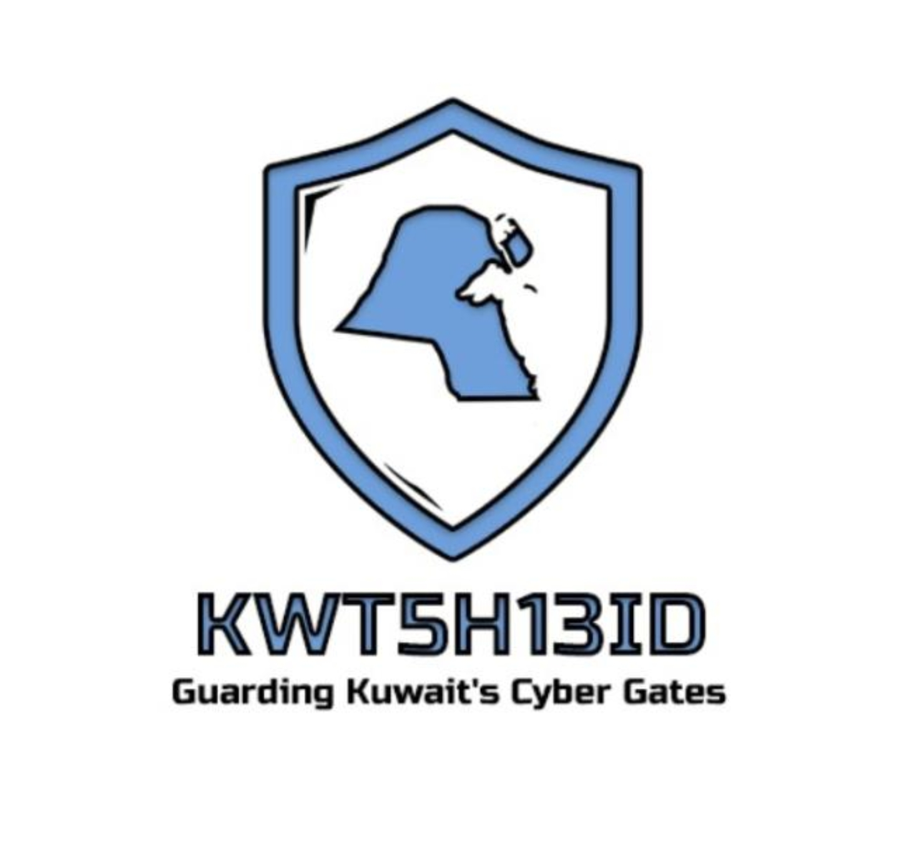

<p align="center">
  
</p>

<h1 align="center">KWT5H13LD</h1>
<h3 align="center">Kuwait Shield Security Toolkit</h3>
<p align="center"><em>Guarding Kuwait's Cyber Gates</em></p>

<p align="center">
  
  
  
  
  
</p>

---

**KWT5H13LD** is an open-source blue team security toolkit designed to protect, audit, and harden your infrastructure. One tool for everything — from cloud misconfiguration detection to incident response.

Built by security practitioners for security practitioners. No fluff — just the tools you need.

---

## Features

**30+ Security Modules** organized into 9 categories with **200+ automated security checks** — all running on pure bash with zero external dependencies.

### Cloud Security
- **cloud-audit** — Audit cloud storage & service misconfigurations (AWS, Azure, GCP)
- **cloud-iam** — Review IAM policies, roles & privilege escalation paths
- **cloud-network** — Inspect cloud VPC, security groups & firewall rules

### System Hardening
- **harden-linux** — Linux CIS benchmark hardening assessment
- **harden-ssh** — SSH configuration security audit
- **harden-kernel** — Kernel parameter & sysctl security check
- **harden-services** — Service enumeration & unnecessary service detection

### Network Defense
- **net-scan** — Network discovery & service enumeration
- **net-firewall** — Firewall rule audit & gap analysis
- **net-dns** — DNS security assessment (zone transfers, DNSSEC, SPF/DMARC)
- **net-tls** — TLS/SSL certificate & cipher audit

### Vulnerability Assessment
- **vuln-system** — System vulnerability scan (CVE check, SUID/SGID)
- **vuln-web** — Web application security headers & config check
- **vuln-deps** — Dependency & package vulnerability audit

### Compliance & Policy
- **comply-cis** — CIS Controls v8 assessment
- **comply-iso27001** — ISO 27001 control mapping check
- **comply-pci** — PCI DSS v4.0 requirement validation
- **comply-password** — Password policy audit

### Log Analysis & Monitoring
- **log-auth** — Authentication log analysis (brute force detection)
- **log-syslog** — Syslog anomaly & pattern detection
- **log-audit** — Auditd log review & suspicious activity flagging

### Incident Response
- **ir-snapshot** — System state snapshot for forensic baseline
- **ir-processes** — Running process analysis & anomaly detection
- **ir-connections** — Active network connection investigation
- **ir-persistence** — Persistence mechanism detection (cron, systemd, profiles)

### Container & Orchestration
- **container-docker** — Docker security audit (CIS Docker Benchmark)
- **container-k8s** — Kubernetes cluster security assessment
- **container-images** — Container image vulnerability & config scan

### Asset & Inventory
- **asset-inventory** — System asset & software inventory collection
- **asset-ports** — Port & service inventory mapping

---

## Quick Start

```bash
# Clone
git clone https://github.com/SiteQ8/KWT5h13ld.git

# Setup
cd KWT5h13ld && chmod +x kwt5h13ld.sh

# Run interactive menu
sudo ./kwt5h13ld.sh

# Or run a specific module
./kwt5h13ld.sh harden-linux
./kwt5h13ld.sh cloud-audit -f json
./kwt5h13ld.sh net-tls -t example.com
./kwt5h13ld.sh ir-snapshot -o /tmp/snapshot.txt
```

## CLI Usage

```
./kwt5h13ld.sh [MODULE] [OPTIONS]

OPTIONS:
  -o, --output FILE      Output report file path
  -f, --format FORMAT    Report format: txt, json, html, csv
  -t, --target HOST      Target host or IP
  -v, --verbose          Enable verbose/debug output
  -q, --quiet            Suppress banner
  -h, --help             Show help
  --no-color             Disable colored output
```

## Web GUI

KWT5H13LD includes a built-in web dashboard for module documentation:

```bash
./kwt5h13ld.sh gui
```

This starts a local web server on `http://localhost:8443` with an interactive guide to all modules.

## Architecture

```
KWT5h13ld/
├── kwt5h13ld.sh          # Main entry point
├── modules/              # All security modules
│   ├── cloud_audit.sh
│   ├── cloud_iam.sh
│   ├── cloud_network.sh
│   ├── harden_linux.sh
│   ├── harden_ssh.sh
│   ├── harden_kernel.sh
│   ├── harden_services.sh
│   ├── net_scan.sh
│   ├── net_firewall.sh
│   ├── net_dns.sh
│   ├── net_tls.sh
│   ├── vuln_system.sh
│   ├── vuln_web.sh
│   ├── vuln_deps.sh
│   ├── comply_cis.sh
│   ├── comply_iso27001.sh
│   ├── comply_pci.sh
│   ├── comply_password.sh
│   ├── log_auth.sh
│   ├── log_syslog.sh
│   ├── log_audit.sh
│   ├── ir_snapshot.sh
│   ├── ir_processes.sh
│   ├── ir_connections.sh
│   ├── ir_persistence.sh
│   ├── container_docker.sh
│   ├── container_k8s.sh
│   ├── container_images.sh
│   ├── asset_inventory.sh
│   ├── asset_ports.sh
│   └── report_gen.sh
├── gui/                  # Web-based dashboard
│   └── index.html
├── config/               # Configuration files
├── logs/                 # Runtime logs
├── reports/              # Generated reports
└── logo.png              # KWT5H13LD logo
```

## Author

**Ali AlEnezi** — KWT5H13LD Team

- GitHub: [@SiteQ8](https://github.com/SiteQ8)
- Email: Site@hotmail.com

## License

MIT License — see [LICENSE](LICENSE) for details.

---

<p align="center">
  <strong>KWT5H13LD — Guarding Kuwait's Cyber Gates</strong><br>
  <em>Open source. Made in Kuwait 🇰🇼</em>
</p>
