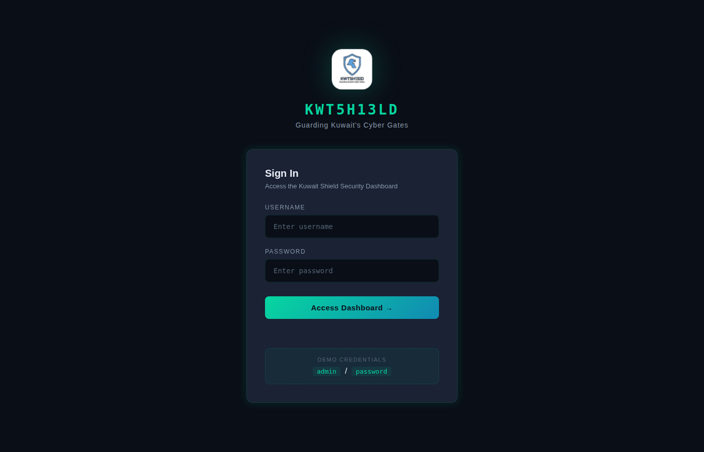
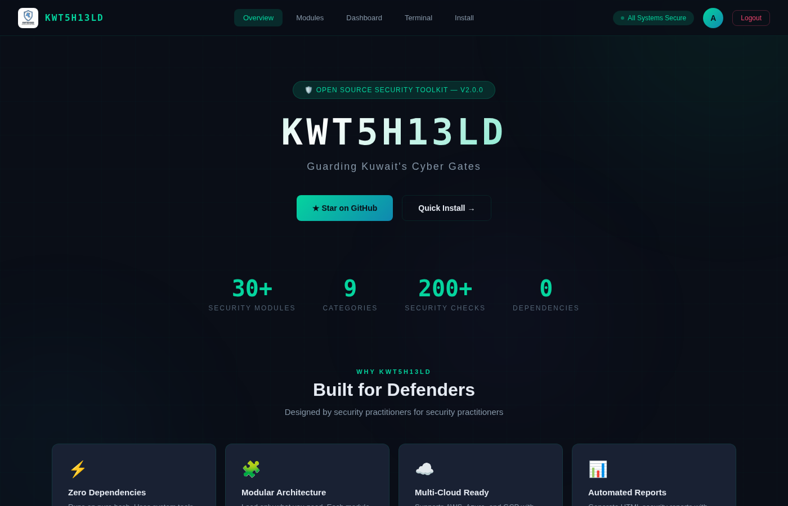
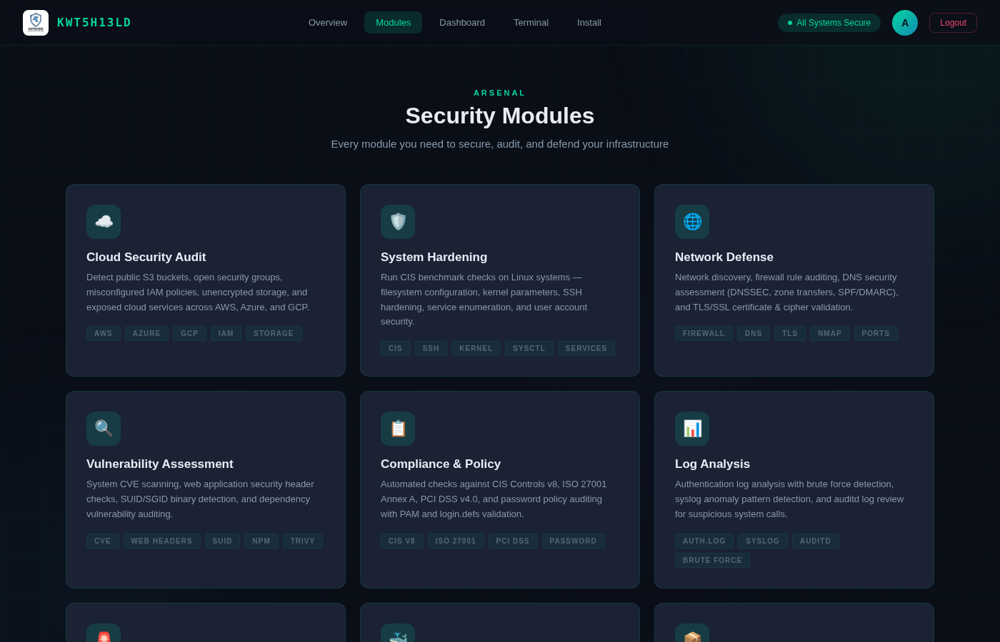
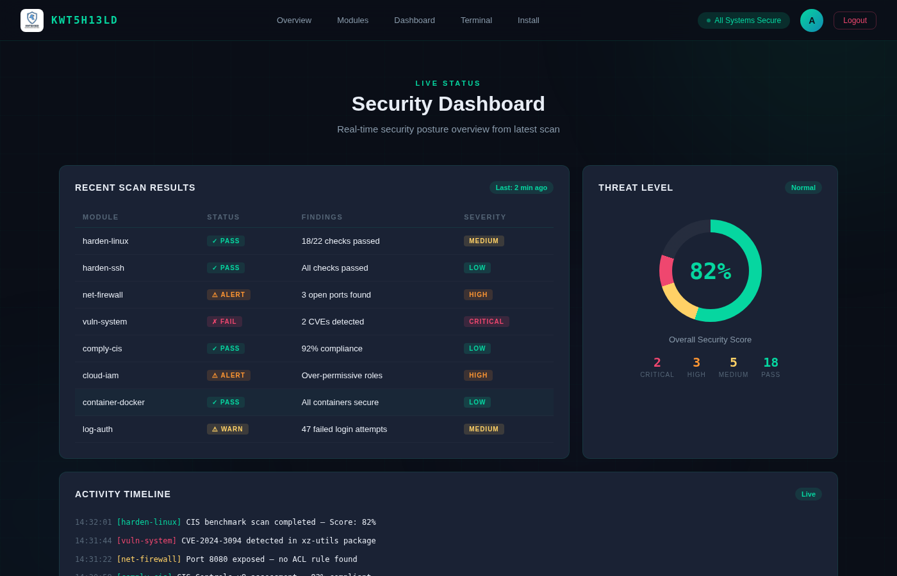
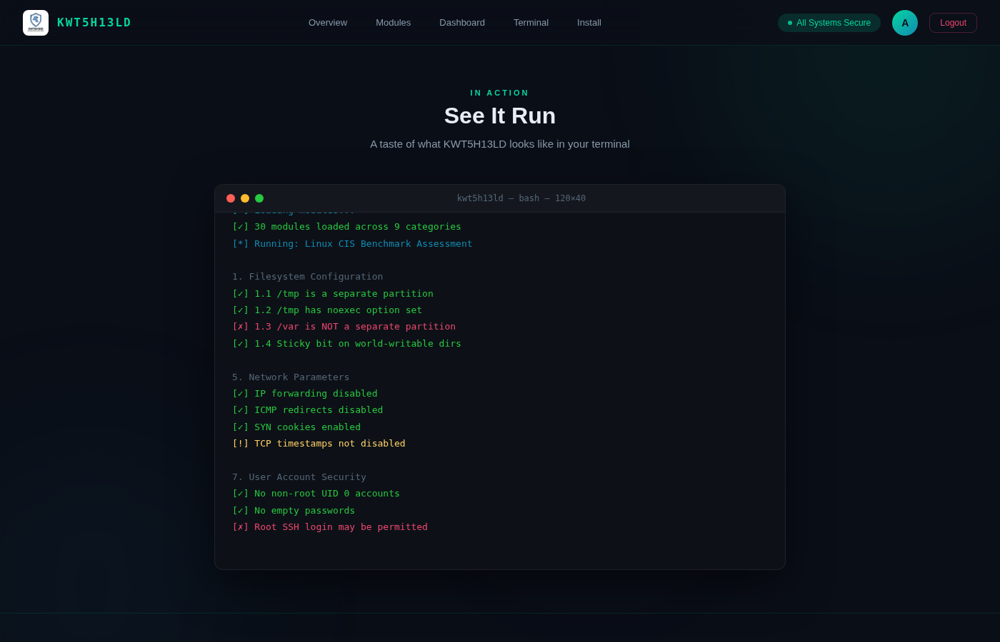

<p align="center">
  
</p>

<h1 align="center">KWT5H13LD</h1>
<h3 align="center">Kuwait Shield Security Toolkit</h3>
<p align="center"><em>Guarding Kuwait's Cyber Gates</em></p>

<p align="center">
  
  
  
  
  
  
  
</p>

---

**KWT5H13LD** is an open-source blue team security toolkit designed to protect, audit, and harden your infrastructure. One tool for everything — from cloud misconfiguration detection to incident response.

Built by security practitioners for security practitioners. No fluff — just the tools you need.

---

## 🖥️ Live Demo

**[Launch the Interactive GUI →](https://siteq8.github.io/KWT5h13ld/gui/)**

> **Demo Credentials:** Username: `admin` / Password: `password`

---

## 📸 Screenshots

### Login Page
<p align="center">
  
</p>

### Overview Dashboard
<p align="center">
  
</p>

### Security Modules
<p align="center">
  
</p>

### Security Dashboard
<p align="center">
  
</p>

### Terminal Demo
<p align="center">
  
</p>

---

## ⚡ Quick Start

```bash
# Clone the repository
git clone https://github.com/SiteQ8/KWT5h13ld.git

# Make it executable
cd KWT5h13ld && chmod +x kwt5h13ld.sh

# Run the toolkit (interactive mode)
sudo ./kwt5h13ld.sh

# Or run a specific module
./kwt5h13ld.sh harden-linux -v
```

---

## 🛡️ Features

**30+ Security Modules** organized into 9 categories with **200+ automated security checks** — all running on pure bash with zero external dependencies.

### Cloud Security
- **cloud-audit** — Audit cloud storage & service misconfigurations (AWS, Azure, GCP)
- **cloud-iam** — Review IAM policies, roles & privilege escalation paths
- **cloud-network** — Inspect cloud VPC, security groups & firewall rules

### System Hardening
- **harden-linux** — Linux CIS benchmark hardening assessment
- **harden-ssh** — SSH configuration security audit
- **harden-kernel** — Kernel parameter & sysctl security check
- **harden-services** — Service enumeration & unnecessary service detection

### Network Defense
- **net-scan** — Network discovery & service enumeration
- **net-firewall** — Firewall rule audit & gap analysis
- **net-dns** — DNS security assessment (zone transfers, DNSSEC, SPF/DMARC)
- **net-tls** — TLS/SSL certificate & cipher audit

### Vulnerability Assessment
- **vuln-system** — System vulnerability scan (CVE check, SUID/SGID)
- **vuln-web** — Web application security headers & config check
- **vuln-deps** — Dependency & package vulnerability audit

### Compliance & Policy
- **comply-cis** — CIS Controls v8 automated assessment
- **comply-iso27001** — ISO 27001 Annex A compliance check
- **comply-pci** — PCI DSS v4.0 requirements validation
- **comply-password** — Password policy audit (PAM & login.defs)

### Log Analysis
- **log-auth** — Authentication log analysis & brute force detection
- **log-syslog** — Syslog anomaly pattern detection & alerting

### Incident Response
- **ir-snapshot** — Forensic system state snapshot
- **ir-processes** — Running process anomaly detection
- **ir-connections** — Active connection investigation
- **ir-persistence** — Persistence mechanism scanning (cron, systemd, profiles)

### Container Security
- **container-docker** — Docker CIS Benchmark audit
- **container-k8s** — Kubernetes cluster security assessment
- **container-images** — Container image vulnerability scan

### Asset Inventory
- **asset-inventory** — System asset & software inventory collection
- **asset-ports** — Port-to-service mapping & discovery

---

## 🏗️ Architecture

```
KWT5h13ld/
├── kwt5h13ld.sh              # Main toolkit entry point
├── modules/                   # Security modules (30+)
│   ├── cloud_audit.sh
│   ├── harden_linux.sh
│   ├── net_firewall.sh
│   ├── vuln_system.sh
│   ├── comply_cis.sh
│   ├── log_auth.sh
│   ├── ir_snapshot.sh
│   ├── container_docker.sh
│   ├── asset_inventory.sh
│   ├── report_gen.sh
│   └── ...
├── gui/                       # Interactive web GUI
│   └── index.html
├── docs/                      # Documentation & screenshots
│   └── screenshots/
├── config/                    # Configuration files
├── reports/                   # Generated reports (HTML/TXT/JSON)
├── logs/                      # Runtime logs
└── .github/                   # CI/CD, templates, workflows
    ├── workflows/security.yml
    ├── ISSUE_TEMPLATE/
    ├── PULL_REQUEST_TEMPLATE.md
    ├── CODEOWNERS
    └── dependabot.yml
```

---

## 🔑 Key Highlights

| Feature | Details |
|---------|---------|
| **Zero Dependencies** | Pure bash — uses system tools already on your servers |
| **Modular Design** | Each module is self-contained and independently runnable |
| **Multi-Cloud** | AWS, Azure, GCP with native CLI integration |
| **Framework Aligned** | CIS Controls v8, ISO 27001, PCI DSS v4.0, NIST |
| **Report Generation** | HTML, TXT, JSON output with pass/fail scoring |
| **Interactive + CLI** | Full menu mode and direct CLI for CI/CD pipelines |
| **Web GUI** | Modern dashboard with login, scan results, and live activity |
| **Made in Kuwait** | Built for the Kuwait & global cybersecurity community 🇰🇼 |

---

## 📋 Requirements

- **OS**: Linux (Ubuntu, Debian, CentOS, RHEL, Fedora, Arch)
- **Bash**: 4.0+
- **Root**: Required for system-level security checks
- **Optional**: `aws-cli`, `az`, `gcloud` (cloud modules), `docker`, `kubectl` (container modules), `nmap` (network modules)

---

## 📖 Documentation

- [Contributing Guide](CONTRIBUTING.md) — How to contribute
- [Code of Conduct](CODE_OF_CONDUCT.md) — Community guidelines
- [Security Policy](SECURITY.md) — Reporting vulnerabilities
- [Support](SUPPORT.md) — Getting help
- [Changelog](CHANGELOG.md) — Version history

---

## 🤝 Contributing

Contributions are welcome! Please read our [Contributing Guide](CONTRIBUTING.md) and [Code of Conduct](CODE_OF_CONDUCT.md) before getting started.

```bash
# Fork, clone, branch, code, test, push, PR
git checkout -b feature/your-feature-name
# Make your changes
git push origin feature/your-feature-name
```

---

## 📄 License

This project is licensed under the **MIT License** — see the [LICENSE](LICENSE) file for details.

---

## 👤 Author

**Ali AlEnezi** — [@SiteQ8](https://github.com/SiteQ8)

Cybersecurity practitioner specializing in security architecture, compliance frameworks, and offensive security tooling.

📧 [Site@hotmail.com](mailto:Site@hotmail.com)

---

<p align="center">
  
  <br>
  <strong>KWT5H13LD</strong>
  <br>
  <em>Guarding Kuwait's Cyber Gates — Open Source Security Toolkit</em>
  <br><br>
  <a href="https://github.com/SiteQ8/KWT5h13ld">GitHub</a> · 
  <a href="https://siteq8.github.io/KWT5h13ld/gui/">Live Demo</a> · 
  <a href="LICENSE">MIT License</a> · 
  Made in Kuwait 🇰🇼
</p>
